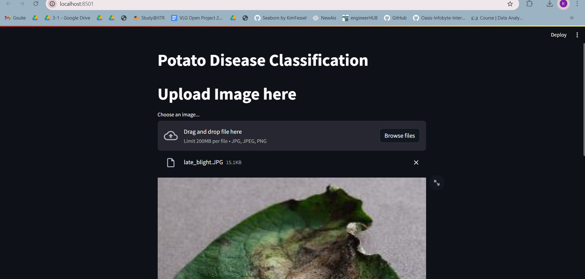

# Early Detection of Potato Diseases Using CNN 🌿🥔

This project leverages Convolutional Neural Networks (CNNs) to classify potato leaf diseases. The primary goal is to develop a robust deep learning model capable of accurately identifying diseases from potato plant leaf images. The solution utilizes Keras and TensorFlow frameworks to build the classification model.

# Results and UI check

- **UI (streamlit)**
  

- **Results**
  

# Project Overview

Potato plants are vulnerable to various diseases that can drastically affect yield. Early identification is essential for farmers to take preventive measures and minimize crop loss. This project addresses three critical classes for potato leaf disease detection:

    1. Late Blight
    2. Early Blight
    3. Healthy Leaves

By automating this classification through deep learning, farmers can achieve timely intervention.

# Dataset

The dataset used for this project is sourced from the PlantVillage Dataset (available on Kaggle). It contains labeled images of healthy and diseased potato leaves, ideal for training the CNN model to recognize patterns associated with different conditions.

# Model Architecture

The CNN model is designed with layers optimized for image classification:

* Convolutional Layers: Extract essential features from the input images.
* MaxPooling Layers: Reduce spatial dimensions to make computations efficient.
* Flattening Layer: Converts feature maps into a one-dimensional vector for input to the Dense layer.
* Dense Layers: Enable learning complex patterns.
* Activation Functions:
- ReLU for hidden layers to introduce non-linearity.
- Softmax for output to provide class probabilities.

# Installation and Running the Web-App

## 1.  Clone the Repository

```
git clone https://github.com/KaranS2111/potato-disease-detection
cd potato-disease-detection
```

## 2. Install dependencies

```
pip install -r requirements.txt
```

## 3. To run Streamlit App

```
streamlit run app.py 
```

# Model Performance 

- Training accuracy : 98.03
- Test accuracy : 96.4
